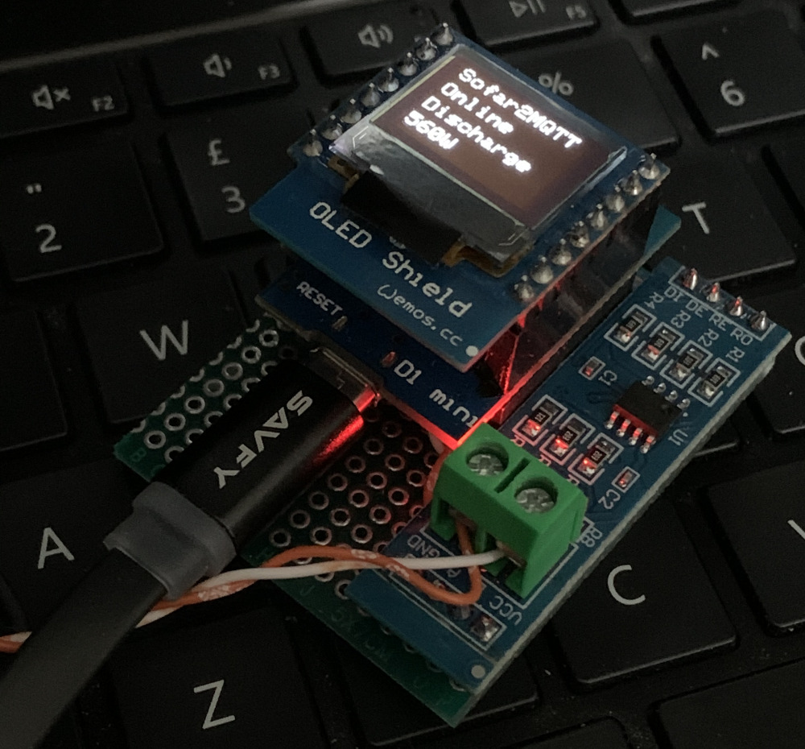
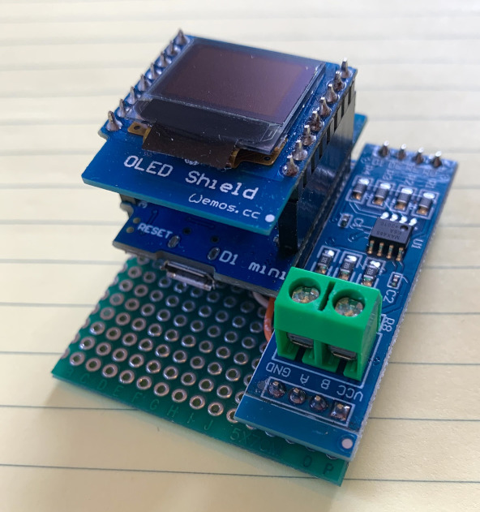
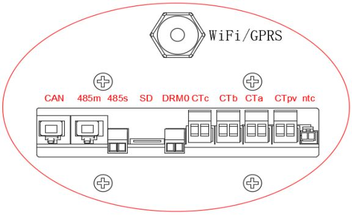

# Sofar2MQTT
## An MQTT modbus interface for Sofar solar battery inverters.

Fully working with the ME3000SP.  
Tested on HYD-x000-ES models and confirmed working in read-only mode.

Sofar2MQTT is a modbus interface for Sofar solar battery inverters.
It allows remote control of the inverter when in passive mode by sending MQTT messages and reports the invertor status, power usage, battery state etc via outgoing MQTT messages.  
For read only mode, it will send status messages without the inverter needing to be in passive mode.  
It's designed to run on an ESP8266 microcontroller with a TTL to RS485 module such as MAX485 or MAX3485.  
Tested and working with either MAX485 or MAX3485 with or without the DR and RE pins. If your TTL module does not have these pins then just ignore the wire from D5. 

Subscribe your MQTT client to these queues:

sofar/running_state  
sofar/grid_voltage  
sofar/grid_current  
sofar/grid_freq  
sofar/battery_power  
sofar/battery_voltage  
sofar/battery_current  
sofar/batterySOC  
sofar/battery_temp  
sofar/battery_cycles  
sofar/grid_power  
sofar/consumption  
sofar/solarPV  
sofar/today_generation  
sofar/today_exported  
sofar/today_purchase  
sofar/today_consumption  
sofar/inverter_temp  
sofar/inverterHS_temp  
sofar/solarPVAmps  

With the inverter in Passive Mode, send MQTT messages to these queues:

sofar/standby   - send value true  
sofar/auto   - send value true or battery_save  
sofar/charge   - send value in the range 0-3000 (watts)  
sofar/discharge   - send value in the range 0-3000 (watts)  

battery_save is a hybrid auto mode that will charge from excess solar but not dischange.

(c)Colin McGerty 2021 colin@mcgerty.co.uk  
calcCRC by angelo.compagnucci@gmail.com and jpmzometa@gmail.com

# How To Build

Parts List:
1. ESP8266 Microcontroller
2. MAX485 or MAX3485 TTL to RS485 board
3. Wemos 64x48 OLED Screen (optional)
4. A small project board
5. A few wires and a little solder

Cut the project board to a convenient size.

Wire the componets according to this circuit diagram.

I tend to keep the wires on top of the board, poke them through and solder underneath. Your approach may be better and your soldering will almost certainly be better than mine!

Make sure you connect the DR and RE pins together. The red arrow below shows where a single wire from D5 connects to both DR and RE.

Use long pinned mounts on your ESP8266 if you are stacking the optional OLED on top.

Here's how it looks when completed.

# Flashing

Open Sofar2MQTT.ino in the Arduino IDE.

Edit Sofar2MQTT.ino with your wifi network name and password and your mqtt server details. 

You'll need the libraries for the ESP8266. Follow [this guide](https://randomnerdtutorials.com/how-to-install-esp8266-board-arduino-ide/) if you haven't completed that step before.

Add a few more libraries using the Manage Libraries menu:
1. PubSubClient
2. Adafruit GFX
3. Adafruit SSD1306 Wemos Mini OLED

(Even if you are not using the OLED screen, you should install the Adafruit libraries or it will not compile.)

...and upload.

Run it on the desktop, not connected to you invertor, to test that wifi and mqtt are connected and see some messages in the serial monitor.
The OLED screen should show "Online" to indicate a connection to WiFi and MQTT. It will alternate between "RS485 Error" and "CRC-FAULT" to indicate that the inverter is not connected.

# Connect to Inverter

Connect the Sofar2MQTT unit to a 5v micro USB power supply.
Now connect wires A and B to the two wire RS485 input of your inverter, which is marked as 485s on the image of the ME3000SP below.

