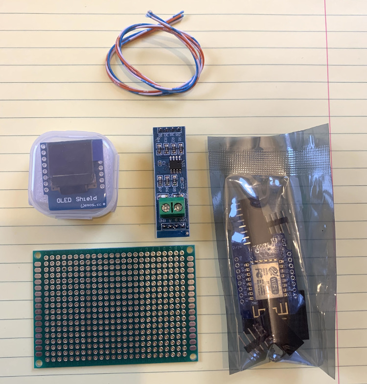
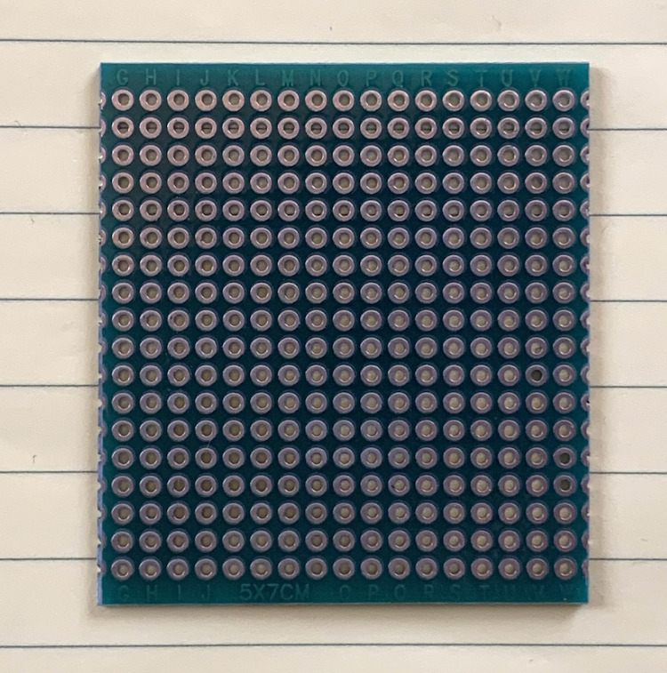
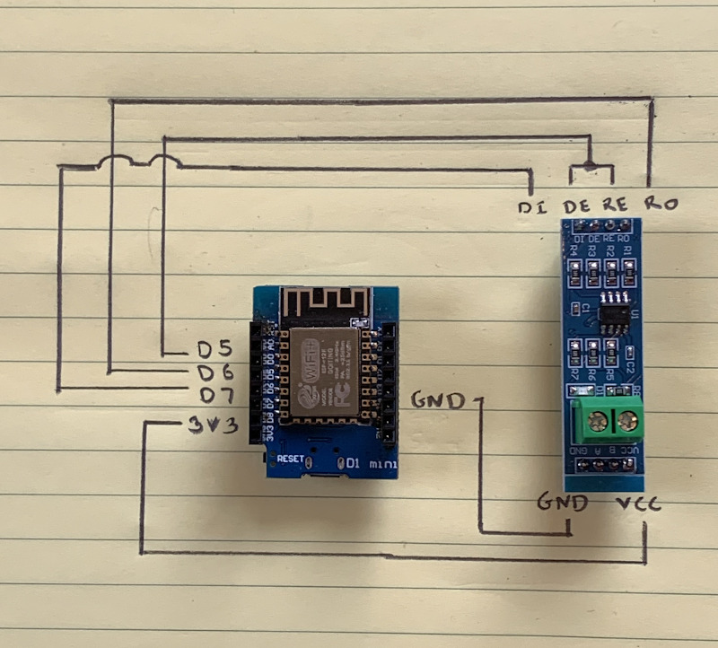
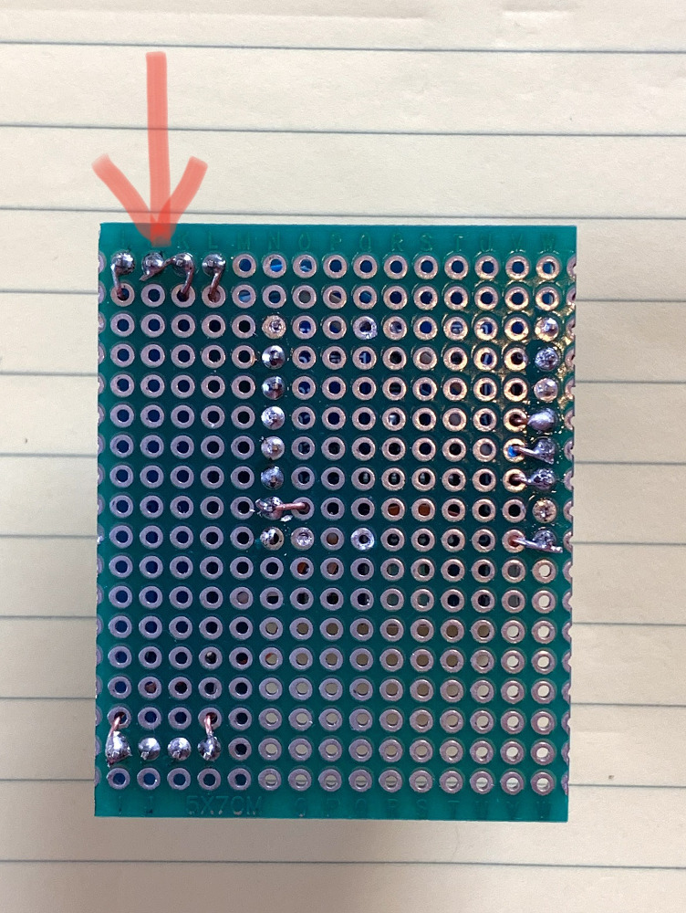
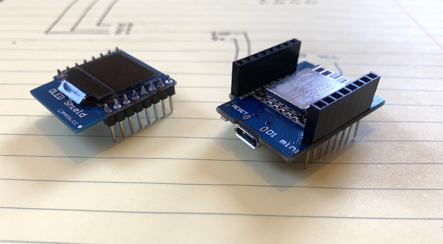

# SofarCtrl

SofarCtrl is a modbus interface for the Sofar ME3000SP solar battery inverter.
It allows control of the ME3000 in passive mode via incoming MQTT messages and reports
back the invertor status, power usage, battery state etc via outgoing MQTT messages.
It's designed to run on an ESP8266 microcontroller with a TTL to RS485 module such as MAX485 or MAX3485.

Subscribe your MQTT server to these queues:
sofar/running_state
sofar/grid_voltage
sofar/grid_current
sofar/grid_freq
sofar/battery_power
sofar/battery_voltage
sofar/battery_current
sofar/batterySOC
sofar/battery_temp
sofar/battery_cycles
sofar/grid_power
sofar/consumption
sofar/solarPV
sofar/today_generation
sofar/today_exported
sofar/today_purchase
sofar/today_consumption
sofar/inverter_temp
sofar/inverterHS_temp
sofar/solarPVAmps

Send MQTT messages to these queues:
sofar/standby	send value true or false
sofar/auto		send value true, false or battery_save
sofar/charge	send value in the range 0-3000 (watts)
sofar/discharge	send value in the range 0-3000 (watts)

battery_save is a hybrid auto mode that will charge from excess solar but not dischange.

(c)Colin McGerty 2021 colin@mcgerty.co.uk

# How To Build

Parts List:
ESP8266 Microcontroller
MAX485 or MAX3485 TTL to RS485 board
Wemos 48x64 OLED Screen (optional)
A small project board
A few wires and a little solder

Cut the project board to a convenient size.

Wire the componets according to this circuit diagram.

I tend to keep the wires on top of the board, poke them through and solder underneath. Your approach may be better and your soldering may way be better than mine!

Make sure you connect the DR and RE pins together. The red arrow below shows where a single wire from D5 connects to both DR and RE.

Use long pinned mounts on your ESP8266 if you are stacking the optional OLED on top.

Here's how it looks when completed.

